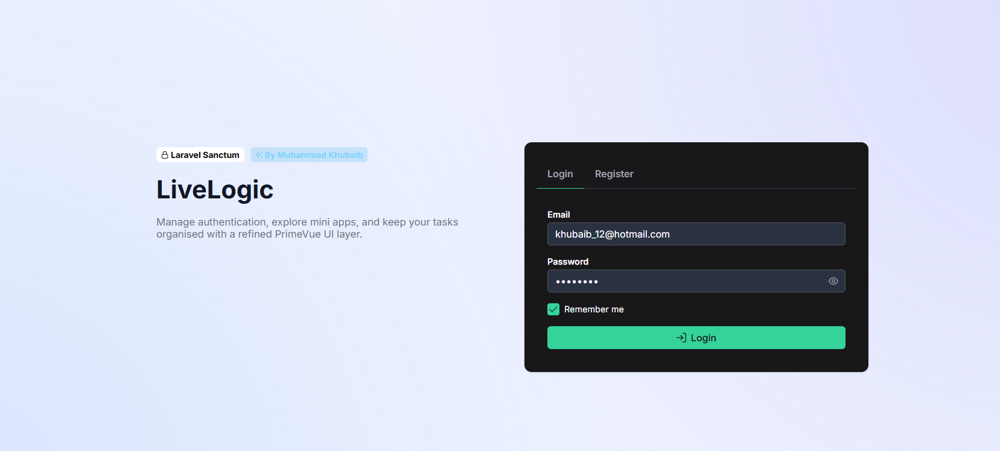
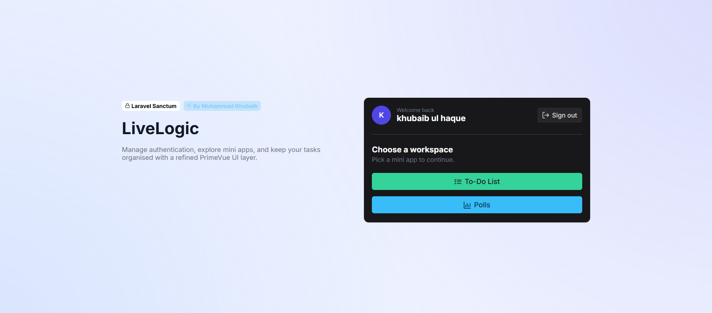
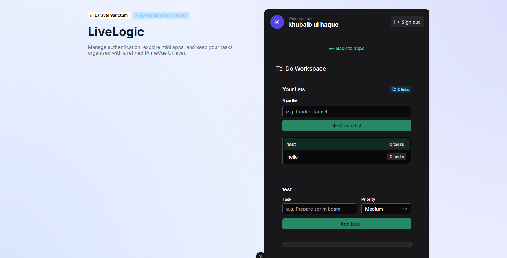

# LiveLogic Tech Test

Full-stack Laravel + Vue (PrimeVue) project demonstrating Sanctum authentication and a to-do mini app.

## Repository Layout

- `backend/` Laravel 10 API serving Sanctum-authenticated endpoints.
- `frontend/` Vue 3 SPA (Vite + PrimeVue + Pinia) consuming the API.

---

## 1. Prerequisites

Make sure the following are installed **before** cloning:

| Tool        | Version (minimum) |
| ----------- | ----------------- |
| Node.js     | 20.19.x (or 22.12.x) |
| npm         | 10.x |
| PHP         | 8.2.x (with `sqlite3` extension enabled) |
| Composer    | 2.x |
| Git         | latest |

> SQLite is used for local development, so you do **not** need MySQL/PostgreSQL. Ensure the PHP `sqlite3` extension is active (it ships with PHP by default).

---

## 2. Clone the repository

```bash
git clone 'https://github.com/khubaibshah/livelogic-techtest'
cd livelogic-techtest
```
---

## 3. Backend setup (Laravel + SQLite)

```bash
cd backend

# install PHP dependencies
composer install

# copy env template
cp .env.example .env
```

Edit `.env` and set the storage/database driver to SQLite:

```
APP_URL=http://localhost:8000
FRONTEND_URL=http://localhost:5173
SANCTUM_STATEFUL_DOMAINS=localhost:5173
SESSION_DOMAIN=localhost

DB_CONNECTION=sqlite
DB_DATABASE=/absolute/path/to/livelogic-techtest/backend/database/database.sqlite
```

> On Windows use a full path such as `C:\\Users\\<you>\\projects\\livelogic-techtest\\backend\\database\\database.sqlite`. Relative paths are not supported in `.env`.

Create the database file:

```bash
php -r "touch('database/database.sqlite');"
```

Now run the usual Laravel scaffolding commands:

```bash
# boot the API keep this terminal running

php artisan serve --host=127.0.0.1 --port=8000
```

Sanctum cookies are now served for requests coming from `http://localhost:5173`.

---

## 4. Frontend setup (Vue + PrimeVue)

Open **a second terminal** in the repo root:

```bash
cd frontend

# install node dependencies (PrimeVue, PrimeIcons, etc.)
npm install

# copy env template unless there is one already you can skip this step
cp .env.example .env
```

Edit `frontend/.env` so the Vue app knows where the API lives:

```
VITE_API_URL=http://localhost:8000
```

Now start the Vite dev server:

```bash
npm run dev
```

By default the SPA serves on `http://localhost:5173`. Keep this process running while developing.

---

## 5. Logging in

1. Register on the frontend (or use `php artisan tinker` to create a user manually).
2. PrimeVue handles the UI; the login form calls the Sanctum `/login` endpoint and stores the user via cookies.
3. Once signed in you can launch the To-Do workspace and manage lists/tasks.

---

## 6. Useful scripts

### Backend

```bash
php artisan test        # run feature/unit tests
php artisan migrate:fresh --seed
php artisan config:cache
php artisan route:cache
```

### Frontend

```bash
npm run lint            # eslint + prettier
npm run type-check      # vue-tsc
npm run build           # production build (outputs to dist/)
npm run preview         # serve the production build locally
```

For production deploys, point the web server to `backend/public`. Copy the `frontend/dist` files into `backend/public` (or serve them behind a CDN) and ensure environment variables are set appropriately.

---

## 7. Troubleshooting

| Issue | Fix |
| ----- | --- |
| `no such table` errors | Ensure `database/database.sqlite` exists and migrations ran successfully. |
| Sanctum cookie not set | Double-check `.env` values (`SESSION_DOMAIN`, `SANCTUM_STATEFUL_DOMAINS`, `APP_URL`) and make sure frontend runs on `http://localhost:5173`. |
| CORS error | `config/cors.php` already whitelists `localhost:5173`. If you change the frontend port, update `FRONTEND_URL` and `SANCTUM_STATEFUL_DOMAINS`. |
| `npm run dev` complains about missing PrimeVue components | Delete `node_modules` and reinstall (`rm -rf node_modules package-lock.json && npm install`). |

---

## 8. PHP unit tests

The backend ships with PHPUnit feature coverage for every Sanctum-protected to-do endpoint (list CRUD + task CRUD) and the /api/user profile route. Tests seed users/lists/tasks via model factories and exercise both success and validation paths.

Run everything with:


# from backend/
`
cd backend
`
`
php artisan test
`

The suite boots the application with an in-memory SQLite database (configured in phpunit.xml), so no extra setup is required beyond composer install.


## 9. Screenshots

### Login
 

### Landing page
 

### TODO APP
 
